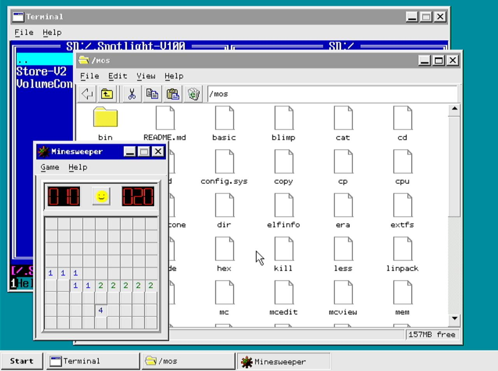
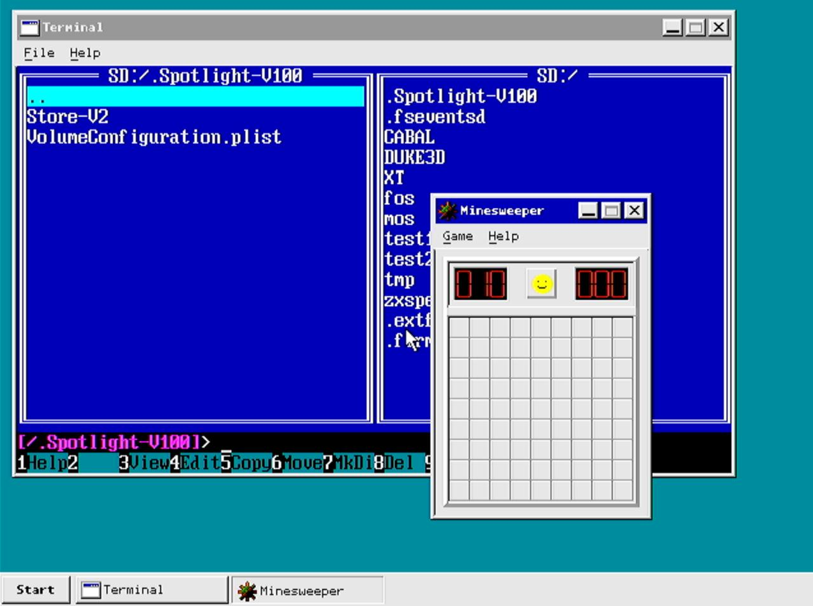
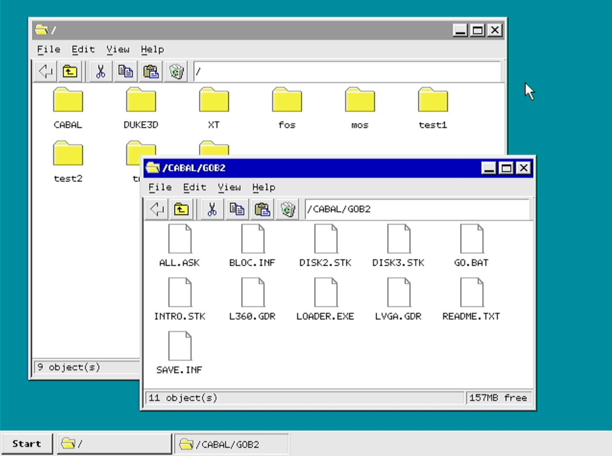

# FRANK OS

A FreeRTOS-based operating system for the RP2350 microcontroller, featuring a windowed desktop environment with PS/2 keyboard and mouse input, DVI display output via HSTX, SD card filesystem support, and the ability to load and run ELF binaries. Compatible with [Murmulator OS 2](https://github.com/DnCraptor/murmulator-os2) applications.







## Features

- **Windowed desktop environment** — overlapping windows with title bars, menus, drag-to-move, and a taskbar with Start menu
- **Terminal emulator** — multiple concurrent terminal windows, each running its own shell instance
- **Built-in shell** — command-line interface with built-in commands and the ability to launch ELF apps from SD card
- **File manager** — graphical file browser with large/small icon and list views, cut/copy/paste, and navigation history
- **ELF binary loading** — load and execute standalone applications compiled against the MOS2 API
- **PS/2 keyboard and mouse** — direct PS/2 input with full keyboard mapping and mouse cursor support
- **DVI video output** — 640×480 display via RP2350's HSTX peripheral (4-bit paletted, 16-color CGA/EGA palette)
- **SD card filesystem** — FAT32 via SPI with FatFs
- **PSRAM support** — external QSPI PSRAM for application memory (auto-detected at boot)
- **FreeRTOS scheduler** — preemptive multitasking with separate tasks for input, compositing, USB, and applications
- **Hard fault recovery** — crash dump saved to uninitialized SRAM, survives warm resets for post-mortem debugging
- **MOS2 compatibility layer** — system function table and POSIX/musl stubs for running Murmulator OS 2 applications

## Supported Board

FRANK OS targets the **FRANK M2** board — an RP2350B-based development board with DVI output, PS/2 ports, SD card slot, and PSRAM.

- **MCU:** RP2350B (QFN-80, 48 GPIO)
- **Flash:** 4 MB
- **PSRAM:** QSPI (optional, auto-detected)
- **Video:** DVI via HSTX peripheral
- **Input:** PS/2 keyboard + PS/2 mouse
- **Storage:** SD card (SPI mode)
- **LED:** GPIO 25

> **Note:** The M1 board layout is no longer supported. FRANK OS builds exclusively for the M2 GPIO layout.

## GPIO Pinout (M2 Layout)

### DVI (HSTX)
| Signal | GPIO |
|--------|------|
| CLK−   | 12   |
| CLK+   | 13   |
| D0−    | 14   |
| D0+    | 15   |
| D1−    | 16   |
| D1+    | 17   |
| D2−    | 18   |
| D2+    | 19   |

### PS/2 Keyboard
| Signal | GPIO |
|--------|------|
| CLK    | 2    |
| DATA   | 3    |

### PS/2 Mouse
| Signal | GPIO |
|--------|------|
| CLK    | 0    |
| DATA   | 1    |

### SD Card (SPI)
| Signal   | GPIO |
|----------|------|
| CLK      | 6    |
| CMD/MOSI | 7    |
| DAT0/MISO| 4    |
| DAT3/CS  | 5    |

### PSRAM (QSPI CS1)
| Package     | GPIO |
|-------------|------|
| RP2350A (QFN-60) | 8  |
| RP2350B (QFN-80) | 47 |

> Pin is auto-detected at runtime based on the RP2350 package variant.

### Audio (PWM, active on MOS2 apps)
| Signal | GPIO |
|--------|------|
| PWM0   | 20   |
| PWM1   | 21   |
| Beeper | 22   |

## Keyboard Shortcuts

| Shortcut | Action |
|----------|--------|
| Win+T | Open a new terminal window |
| Win+E | Open file manager |
| Win (alone) | Toggle Start menu |
| Alt+Tab | Cycle focus between windows |
| Alt+Space | Open system menu for focused window |
| Alt+F4 | Close focused window |

## Requirements

- Raspberry Pi Pico 2 (RP2350) or compatible board (FRANK M2 recommended)
- [Pico SDK](https://github.com/raspberrypi/pico-sdk) (version 2.0+) installed and configured
- ARM GCC toolchain
- CMake 3.13+
- `picotool` (for flashing)

## Building

### Prerequisites

1. Install the [Raspberry Pi Pico SDK](https://github.com/raspberrypi/pico-sdk) (version 2.0+)
2. Set environment variable: `export PICO_SDK_PATH=/path/to/pico-sdk`
3. Install ARM GCC toolchain (`arm-none-eabi-gcc`)
4. Install CMake 3.13+

### Build Steps

```bash
# Clone the repository with submodules
git clone --recursive https://github.com/rh1tech/frankos.git
cd frankos

# Or if already cloned, initialize submodules
git submodule update --init --recursive

# Build
./build.sh
```

The build script removes any previous `build/` directory, runs CMake, and compiles with `make -j4`. The output firmware is placed in `build/`.

### Build Configuration

The following CMake options can be adjusted in `CMakeLists.txt`:

| Option | Default | Description |
|--------|---------|-------------|
| `PSRAM_SPEED` | `84` | PSRAM max frequency in MHz (set to empty to disable HW init) |
| `CPU_CLOCK_MHZ` | `252` | CPU clock speed in MHz |

### Flashing

```bash
# Flash using the provided script
./flash.sh

# Or specify a firmware path
./flash.sh path/to/firmware.elf
```

The flash script uses `picotool` to load the firmware and reboot the device. Both `.elf` and `.uf2` formats are supported.

### Building Apps

MOS2-compatible ELF applications can be built separately:

```bash
cd apps
./build_apps.sh
```

Compiled apps are placed in `apps/compiled/` and can be copied to the SD card for execution from the shell.

## SD Card Setup

1. Format an SD card as FAT32
2. Copy ELF applications to the card
3. Insert the card — it is auto-mounted at boot
4. Use the shell or file manager to browse and launch applications

## Architecture

FRANK OS is structured around FreeRTOS tasks running on Core 0 of the RP2350:

| Task | Priority | Description |
|------|----------|-------------|
| **USB** | Highest | TinyUSB device servicing (CDC serial console) |
| **Input** | 3 | PS/2 keyboard/mouse polling and event routing |
| **Compositor** | 2 | Window manager event dispatch and screen compositing |
| **Heartbeat** | 1 | LED blink (system alive indicator) |
| **Shell** (per terminal) | — | Command-line interpreter for each terminal window |

Core 1 is dedicated to the DispHSTX DVI output driver.

## License

FRANK OS is licensed under the [GNU General Public License v3.0 or later](LICENSE).

Portions derived from Murmulator OS 2 by DnCraptor are used under the same license.

Third-party components retain their original licenses (MIT, BSD-3-Clause, ISC, Apache-2.0) as noted in their respective source files.

## Author

**Mikhail Matveev** <<xtreme@rh1.tech>>
- Website: [https://rh1.tech](https://rh1.tech)

## Acknowledgments

### Murmulator OS 2
- **Project:** [murmulator-os2](https://github.com/DnCraptor/murmulator-os2)
- **Author:** DnCraptor ([GitHub](https://github.com/DnCraptor))
- **License:** GPL-3.0-or-later
- **Description:** The original MOS2 operating system for Murmulator boards. FRANK OS derives its application loading, system table, shell, and POSIX compatibility layer from this project.

### FreeRTOS
- **Project:** [FreeRTOS Kernel](https://github.com/FreeRTOS/FreeRTOS-Kernel)
- **Author:** Amazon Web Services
- **License:** MIT
- **Description:** Real-time operating system kernel used for task scheduling and synchronization.

### DispHSTX
- **Project:** [DispHSTX](https://github.com/Panda381/DispHSTX)
- **Author:** Miroslav Nemecek (Panda38)
- **License:** BSD-3-Clause
- **Description:** DVI display driver using the RP2350 HSTX peripheral.

### FatFs
- **Project:** [FatFs](http://elm-chan.org/fsw/ff/)
- **Author:** ChaN
- **License:** FatFs License (BSD-style)
- **Description:** Generic FAT filesystem module for SD card access.

### Raspberry Pi Pico SDK
- **Project:** [pico-sdk](https://github.com/raspberrypi/pico-sdk)
- **Author:** Raspberry Pi (Trading) Ltd.
- **License:** BSD-3-Clause
- **Description:** Hardware abstraction and build system for RP2040/RP2350 microcontrollers.
